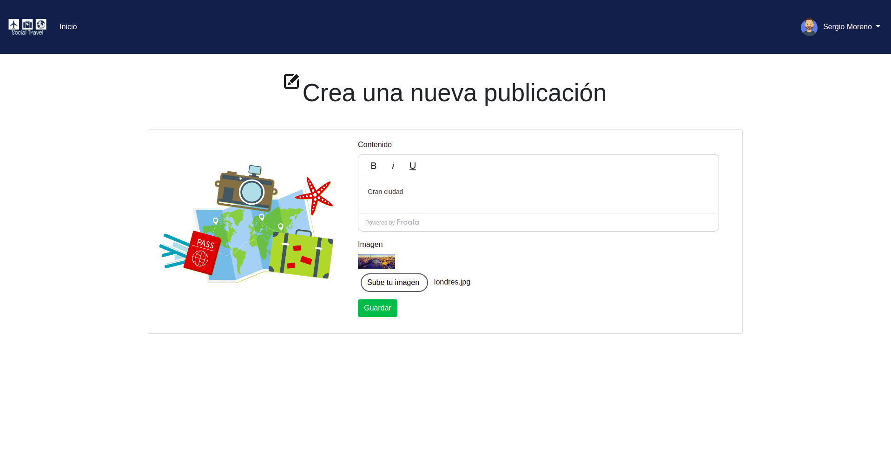

# GeeksHubs-Proyecto-Red-Social-Frontend

_El proyecto es un Frontend, que estructura una red social, donde se podrá realizar todas las acciones descritas en el backend.
La red social tiene como temática los viajes, los usuarios podrán compartir con sus publicaciones los viajes y escapadas realizadas asi como compartir sus experiencias. Cada usuario en su perfil tendrá todas sus publicaciones lo que le servirá a modo de recuerdo

La aplicación es SPA (Single Page Application).

Para el diseño se ha empleado Bootstrap._


## Comenzando 🚀

_Para obtener una copia del proyecto en funcionamiento en tu máquina local para propósitos de desarrollo y pruebas, necesitaras descargarlo o clonar el repositorio a tu máquina._


### Tecnologías🛠️

Programas y Frameworks utilizados para el desarrollo y pruebas del proyecto:

* [VSCode] - Editor de código usado - (https://code.visualstudio.com/).
* [Angular] - Framework de desarrollo.
* [Bootstrap] - Es un frameword de diseño;
* [GitHub] - Control de versiones.


### Instalación 🔧

Requiere tener el backend de la aplicación en funcionamiento, aqui podras encontrar el repositorio del backend.[Wiki](https://github.com/jocamo00/GeeksHubs-ProyectoFinal-RedSocial-Backend.git)

Una vez descargado, descomprimido y ubicado en el directorio del proyecto, instale las dependencias y devDependencies.

```sh
$ npm update -d
```

Inicie el servidor

```sh
$ ng serve
```

Las instrucciones sobre cómo usarlas en su propia aplicación están vinculadas a continuación.
GitHub  [plugins/github/README.md][PlGh] 


#### Código

Método en el servicio para el registro de usuarios
```sh
// Método para el registro, le pasamos el objeto usuario, nos devolvera un observable
  register(user): Observable<any>{
    // Pasa el objeto user a json
    let json = JSON.stringify(user);
    // Parametros que se van a enviar a la API
    let params = 'json='+json;

    // Indica tipo de petición que se va a hacer
    let headers = new HttpHeaders().set('Content-Type', 'application/x-www-form-urlencoded');

    // Se hace la petición al backend, que será de tipo post
    // Se le pasa la url, los datos que queremos enviar y en un json se envia la cabecera
    return this._http.post(this.url+'user', params, {headers: headers});
  }
```


Método en el servicio para el login de usuarios
```sh
signup(user, gettoken = null): Observable<any>{
    // Comprueba si llega el token
    if(gettoken != null){
      user.gettoken = 'true';
    }

    let json = JSON.stringify(user);
    let params = 'json='+json;
    let headers = new HttpHeaders().set('Content-Type', 'application/x-www-form-urlencoded');

    return this._http.post(this.url+'login', params, {headers: headers});
  }
```


Método en el servicio para la edición de usuarios
```sh
update(token, user): Observable<any>{
    // Coge los datos del objeto user y los convierte en JSON string, para poder enviarlos a la API
    let json = JSON.stringify(user);

    // Define los parámetros que se van a enviar
    let params = "json="+json;

    // Define las cabeceras
    let headers = new HttpHeaders().set('Content-Type', 'application/x-www-form-urlencoded')
                                   .set('Authorization', token);

    return this._http.put(this.url + 'user/update', params, {headers: headers});
  }
```


Método en el servicio que muestra el usuario identificado
```sh
getIdentity(){
    // Saca lo que tenemos en identity y lo convierte a objeto
    let identity = JSON.parse(localStorage.getItem('identity'));

    // Si identity es true y diferente a undefined
    if(identity && identity != "undefined"){
      this.identity = identity;
    }else{
      this.identity = null;
    }

    // Devuelve el objeto
    return this.identity;
  }
```


Método en el servicio que muestra el token del usuario identificado
```sh
getToken(){
    // Accede al token
    let token = localStorage.getItem('token');

    if(token && token != "undefined"){
      this.token = token;
    }else{
      this.token = null;
    }

    return this.token;
  }
```


Encryptación de la contraseña
```sh
const salt = await bcrypt.genSalt(10)
const hashPassword = await bcrypt.hash(req.body.password, salt)
```

## Imagenes





## Wiki 📖

Puedes encontrar mucho más de cómo utilizar este proyecto en nuestra [Wiki](https://github.com/jocamo00/GeeksHubs-ProyectoFinal-RedSocial-Frontend.git)

## Versionado 📌

Usamos [GitHub](https://github.com/) para el versionado. Para todas las versiones disponibles, mira los [tags en este repositorio](https://github.com/jocamo00/GeeksHubs-ProyectoFinal-RedSocial-Frontend.git).

## Autor ✒️

* **Jose Carreres** - *Todo el trabajo* - [jocamo00](https://github.com/jocamo00)

## Licencia 📄

Este proyecto está bajo la Licencia http://www.apache.org/licenses/LICENSE-2.0


